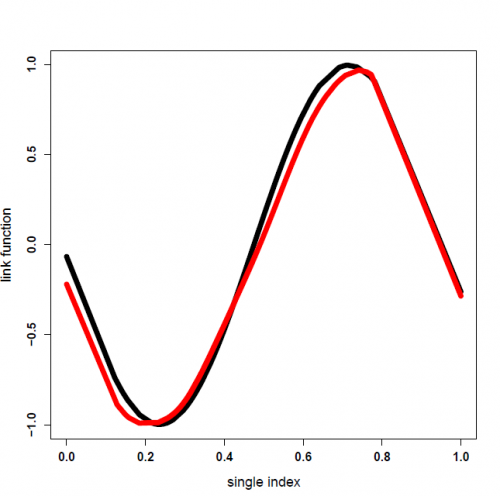

[](http://quantlet.de/)

## [](http://quantlet.de/) **SIMqrL1** [](http://quantlet.de/)

```yaml

Name of Quantlet : SIMqrL1

Published in : Composite Quantile Regression for the Single-Index Model

Description : 'In this part of our simulation we adopt our methodology in quantile regression with
(high dimensional) single index model case. Firstly we generate the initial value of the parameter
beta by using Li, Y. and Zhu, J. (2008)`s L1 norm quantile regression function. Then we run a
two-step iteration. For the first step of the iteration we use local polynomial regression to
estimate the link function and its first derivative. For the second step of the iteration we apply
Li and Zhu`s L1 norm quantile regression function again to estimate the parameter beta. This two
two-step procedure iterates many times until the rate of convergence achieves. Then we input this
final estimated beta into the local polynomial function again to calculate the final link function.
The performance of the final estimated beta can be evaluated by three criteria: dev, acc and angle.
The performance of the final estimated link function can be evaluated by two criteria: err and ase.
For the bandwidth selection we adopt Yu, K. and Jones, M. C. (1998)`s methodology'

Keywords : 'L1-norm penalty, MACE, dimension-reduction, lasso, local polynomial, quantile
regression, single index model, variable selection'

Author : Weining Wang, Lining Yu

See also : quantilelasso

Submitted : November 14 2016 by Lining Yu

Input : 'xx pxn - covariate matrix, nsimu - scalar number of simulation, tau - scalar quantile
level, y n - response vector, beta_in p - the initial value of the parameter beta'

Output : 'beta_final p - the final estimated parameter beta, g_finaln - the final estimated link
function, indexfinal p - the final estimated index'

Example : plot the true link function (black) and the estimated link function (red)

```




### R Code:
```r
########################################
### simulation of single index model ###
########################################
### remove all objects
rm( list = ls( all = TRUE ))
### set the directory
setwd("D:/SIM_2013_02_01") 
### use package "SparseM"
library(SparseM)
### use package "MASS"
library(MASS)
library(quantreg)  
library(KernSmooth)
### use source"quantilelasso" for L1 norm quantile lasso regression (one can also use other lasso function instead of L1 norm quantile lasso function)
source("quantilelasso.r")
### local polynomial regression quantile which is used in the step 1 of the iteration
lprq = function (x, y, h, tau = 0.5,x0)
{
  fv <- x0
  dv <- x0    
  z <- x - x0
  wx <- dnorm(z/h)
  r <- rq(y ~ z, weights = wx, tau = tau, ci = FALSE)
  fv <- r$coef[1]
  dv <- r$coef[2]
  list(x0 = x0, fv = fv, dv = dv)
}
### set the sample size
n = 100
### set quantile level tau
tau = 0.5 
### the true value of beta
beta_true = c(5,5,5,5,5,0,0,0,0,0)
### standardize the true value of beta
beta_true = sign(beta_true[1])*beta_true/sqrt(sum(beta_true^2))
### p is the length of the true beta
p = length(beta_true)
### set the simulation time,  for example 10
nsimu = 10
### start the loop of the simulation ###
for (simu_i in 1: nsimu)
{
  ### generate the covariate matrix xx
  xx = matrix(0, n, 1)
  ### where lth column of xx is an i.i.d. sample from N(l/2, 1), for l from 1 to p.
  for (l in  1:p)
  {
    one_col_xx = rnorm(n, l/2, 1)
    xx = cbind(xx, one_col_xx)
  }
  ### delete the first zero column so that xx becomes a (p times n) matrix
  xx = xx[,-1] 
  ### the true index
  index_true = xx%*%beta_true
  ### the true link function of model_2
  A = 0.3
  B = 3 
  g_true = sin(pi*(A*index_true-B))
  ### the true error e follows N(0, 0.1) distribution
  sigma = 0.1
  e = rnorm(n,mean=0,sd=sigma)
  ### the true value of y for model_2
  y = g_true+e 
  ### L1 norm quantile lasso function, this function comes from source "quantilelasso"
  fit = qrL1(xx,y,tau,1000) #the steps can be adjusted
  ### choose the number which has the minimal value of generalized approximate cross validation criterion
  num = which( fit$Cgacv == min(fit$Cgacv))
  ### the initial estimated value of beta is just the beta corresponding to the above number
  beta_in = fit$beta[num,]
  ### standardize the initial value of beta
  beta_in = sign(beta_in[1])*beta_in/sqrt(sum(beta_in^2)) 
  ### the initial value of penalty lambda is just the lambda corresponding to the above number
  lambda_in = (-fit$lambda[num])
  ### output the initial value of lambda
  cat("lambda_in:", lambda_in,"n")
  ### flag whether the iterations converge
  flag.conv = 0
  ### set the starting value of beta which can be estimated in the iteration ###
  beta_new = beta_in
  ### initialize the parameter of beta which aims to compare the difference of estimators between the current step and the last step in the iteration
  beta_old = 2*beta_new
  #set the maximum number of iteration, for example 10
  maxiter = 10 
  ### initialize the number of iteration
  iter = 1
  ### set the critical value to control the iteration
  crit = 1e-2  
  while((iter < maxiter) & (sum((beta_new-beta_old)^2)>crit))
  {
    ### initialize the link function "a" and  its first derivative "b"
    a = rep(0,n)
    b = rep(0,n)
    beta_old = beta_new
    cat("Simu:",simu_i,"iter:",iter,"n")
    print(iter)
    print(beta_new) 
    iter = iter+1
    ####################################
    #  step 1: compute a_j,b_j; j=1:n  #
    ####################################
    index = rep(0,n)
    for(l in 1:p)
    {
      index = index+xx[,l]*beta_old[l]
    } 
    ordery = sort(y)
    orderx = sort(index)
    hm = dpill(orderx[20:(n-20)], ordery[20:(n-20)]) # this value can be adjusted
    hp = hm*(tau*(1-tau)/(dnorm(qnorm(tau)))^2)^.2
    x0 = 0
    for(j in 1:n)
    {  
      x0 = index[j]
      fit = lprq(index, y, hp, tau, x0) 
      a[j] = fit$fv
      b[j] = fit$dv
    }
    ############################# 
    # step 2: compute beta_new  #
    #############################
    ynew = rep(0,n^2)
    xnew = rep(0,n^2*p)
    xnew = matrix(xnew,ncol=p)
    for (i in 1:n)
    { 
      for (j in 1:n)
      { 
        ynew[(i-1)*n+j] = y[i]-a[j]
        for(jj in 1:p)
        { 
          xnew[(i-1)*n+j,jj] = b[j]*(xx[i,jj]-xx[j,jj])
        }
      } 
    } 
    index_new = rep(0,n^2)
    for(jj in 1:p)
    {
      index_new = index_new+xnew[,jj]*beta_old[jj]
    }  
    index_new_h = rep(0,n^2)
    for (i in 1:n)
    {  
      for (j in 1:n)
      { 
        index_new_h[(i-1)*n+j] = index_new_h[(i-1)*n+j]/hp   
      } 
    } 
    wts = dnorm(index_new_h)
    index_new = wts*index_new
    ynew = wts*ynew            
    for (i in 1:length(wts))
    {
      xnew[i,] = wts[i]*xnew[i,]
    }
    fit =  qrL1(xnew,ynew,tau,2000) #the steps can be adjusted            
    num = which( fit$Cgacv == min(fit$Cgacv))
    beta_new = fit$beta[num,]
    beta_new = sign(beta_new[1])*beta_new/sqrt(sum(beta_new^2))
    lambda_new = -fit$lambda[num]
    cat("lambda_new:",lambda_new, "n")
  } ### end of the iteration
  flag.conv = (iter < maxiter) # = TRUE if converge; = FALSE if not converge
  print(flag.conv)
  beta_final = beta_new
  print(beta_final)
  a = rep(0, n)
  b = rep(0, n)
  index_final = rep(0,n);  
  for(l in 1:p)
  {
    index_final = index_final+xx[,l]*beta_final[l]
  } 
  orderx = sort(index_final)
  ordery = y[order(index_final)]
  hm = dpill(orderx, ordery)
  hp = hm*(tau*(1-tau)/(dnorm(qnorm(tau)))^2)^.2;
  x0=0
  for(j in 1:n)
  {  
    x0 = index_final[j]
    fit = lprq(index_final, y, hp, tau, x0) 
    a[j] = fit$fv
    b[j] = fit$dv
  }
  g_final = a    
  cat("Simu:",simu_i,"n")
  ### scale the true index and the estimated index to [0,1] for the comparison ###
  index_true = (index_true - min(index_true))/(max(index_true)-min(index_true))
  index_final = (index_final - min(index_final))/(max(index_final)-min(index_final))  
  ### plot the estimated link function ###
  spl_true = smooth.spline(sort(index_true),g_true[order(index_true)],df=10)
  plot(spl_true, type="l", lwd=8, xlab="single index", ylab="link function",cex.lab = 1.2,cex.axis = 1.2, font.axis = 2) 
  spl=smooth.spline(sort(index_final), g_final[order(index_final)],df=10)
  lines(spl, lwd=8, col="red")
}  ### end of the simulation

```
